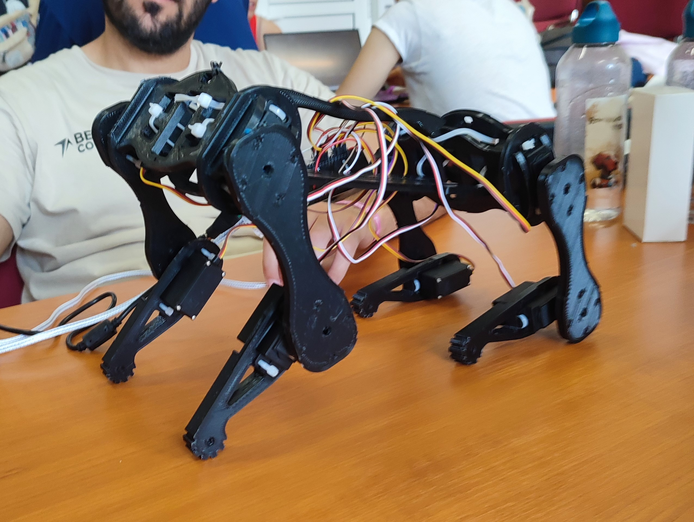

# BEST Course quadruped robot

Project working session materials for "The secret life of robotic pets", a BEST Course in Summer 2023 held in Cluj-Napoca.
Covered schedule slots:
- "Introduction to the course", 1h, Tutorial
- "Robot assembly and basic Arduino programming", 4h, Tutorial
- "Project working sessions", 6h, Workshop

File structure:
- `robo/` - Arduino code of finished robot
- `notes/` - Slide decks
- `software-control/` - Python scripts for calibration and sending movements over HTTP, respectively

