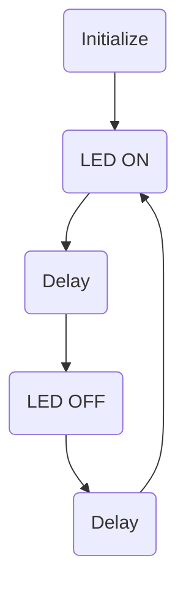
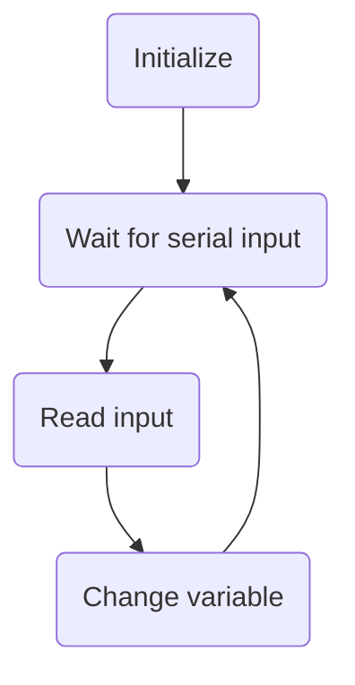
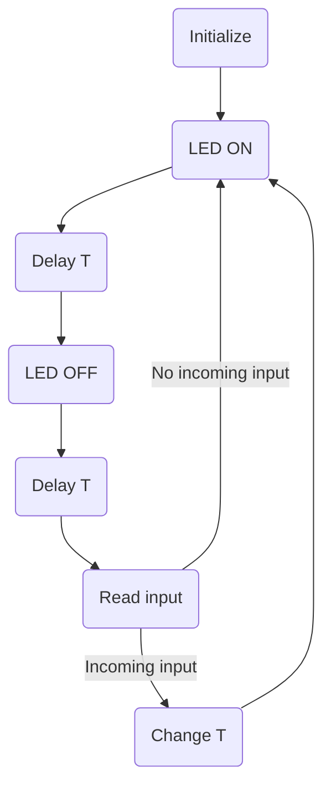
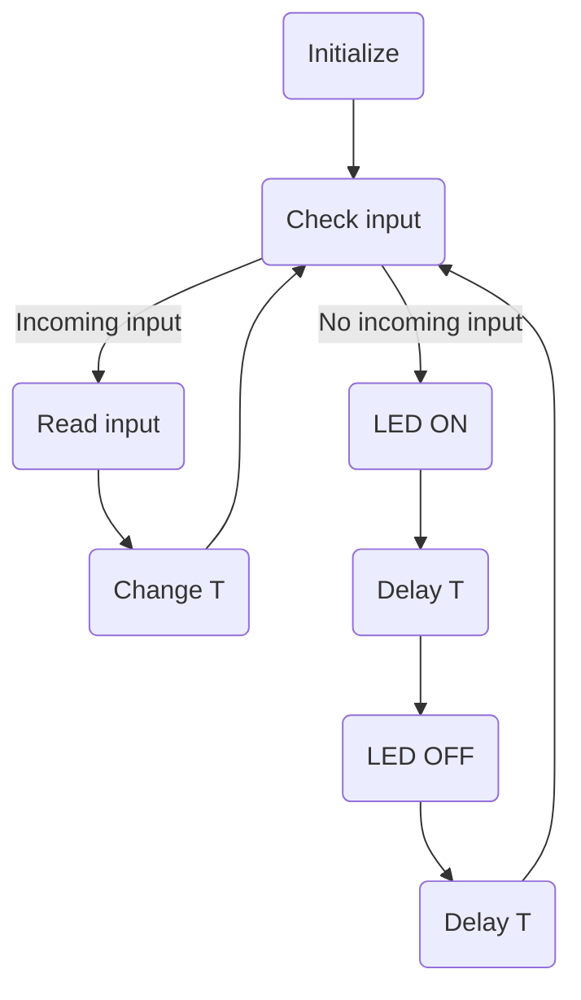
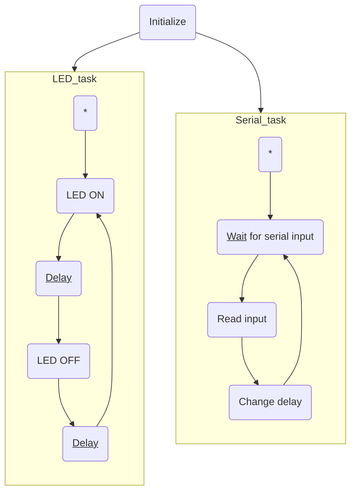

# C++, Arduino tutorial

The secret life of robotic pets

90 - 120 min

:robot::dog:

wifi: `robotzone`

password: `robotzone`

---

## Microcontrollers

![[Arm+Image+1-847381684.jpg|400]]

--

### Pinout diagrams

![[NodeMCUv3.0-pinout.jpg]]

---

## Arduino C++ crash course

--

### Stuff to install

* [Arduino IDE](https://www.arduino.cc/en/software) + ESP8266 library
* [CH340 drivers](https://learn.sparkfun.com/tutorials/how-to-install-ch340-drivers/all#drivers-if-you-need-them)
* [Python](https://www.python.org/downloads/) (for calibration, might only need it tomorrow)

--

### Blink

```c++
void setup() {
	pinMode(5, OUTPUT);
}

void loop() {
	digitalWrite(5, HIGH);
	delay(1000);
	digitalWrite(5, LOW);
	delay(1000);
}
```

--

### Serial communication

```c++
void setup() {
	Serial.begin(115200);
	Serial.println("Hello!");
}

void loop() {
	Serial.print("I have been running for ");
	Serial.print(millis());
	Serial.println(" milliseconds!");
}
```

--

### Variables, strings, conditionals

```c++
void setup() {
	Serial.begin(115200);
	
	Serial.print("What is your favourite color? ");

	// Do nothing until we get some data
	while(Serial.available() == false) {}

	String answer =  Serial.readStringUntil('\n');
	Serial.println("What a " + answer + "ish day!");

	// 
	if(answer == "blue") {
		Serial.println("Blue is also my favourite color!");
	}
}

void loop() {} // Nothing
```

--

### Numeric variables

```c++
int age;
void setup() {
	Serial.begin(115200);
	Serial.print("What is your age? ");

	while(Serial.available() == false) {}
	
	age = Serial.parseInt(); // Or std::atoi(Serial.readStringUntil(' '))
}

int x = 2;
void loop() {
	Serial.print("In ");
	Serial.print(x);
	Serial.print(" years you'll be ");
	Serial.print(age+x);
	Serial.println(" years old");
	x = x + 1; // Or x++
	delay(1000);
}
```

--

### Arrays, loops

```c++
void setup() {
	Serial.begin(115200);

	Serial.println("Give me some input so I may continue");
	while(!Serial.available()) {
		Serial.println("No input yet...");
		delay(1000);
	}
	String received = Serial.readString();
	Serial.println("I got some input: " + received);

	pinMode(5, OUTPUT);
}
```

--

### Arrays, loops

```c++
int blink_durations[] = {1000, 500, 1000, 2000, 100};

void loop() {
	for(int duration : blink_durations) {
		digitalWrite(5, HIGH);
		delay(duration / 2);
		digitalWrite(5, LOW);
		delay(duration / 2);
	}
}
```

--

### Servos, Pulse Width Modulation

![[Pasted image 20230712142240.png]]

--

### Servos, PWM

```c++
void setup() {
	pinMode(16, OUTPUT);

	// Instead of using the Servo library, we will use the analogWrite API
	analogWriteResolution(14); // 14 bits => 16384 levels. 819 levels from 0 to 90 degrees
	analogWriteFreq(50); // Servos expect 50Hz PWM
}

void loop() {
	int calibrate_0 = 819; // 2^14 / 20
	int calibrate_90 = 1638; // 2^14 / 10
	int angle = (millis() / 100) % 90; // You can change this to compute the angle however you want! This is just an example motion
	int duty = map(angle, 0, 90, calibrate_0, calibrate_90);
	analogWrite(16, duty);
	delay(20);
}
```

--

### Structs and classes

```c++
struct PWMFrame {
	int duty_cycle;
	int duration;
};

PWMFrame frames[] = {
	{255, 1000},
	{128, 500},
	{0, 500},
	{128, 1000},
	{200, 123},
	{255, 2000}
};

void setup() {
	Serial.begin(115200);

	pinMode(5, OUTPUT);
	analogWriteResolution(8); // 8 bits => values are 0..255
}

void loop() {
	for(PWMFrame frame : frames) {
		Serial.println("The LED will now be lit for " +
		               frame.duration + "ms " +
		               "with a duty cycle of " + 
		               frame.duty_cycle + "/255");
		analogWrite(5, frame.duty_cycle);
		delay(frame.duration);
	}
}
```

---

## Synchronous vs asynchronous programming

Problem: "Blink", but make the period modifiable via serial

<split>


$$\quad+\quad$$

$$\quad=\ ?$$
</split>

--

### Synchronous programming

<split>

$\quad$ or $\quad$


---

### Multitasking

Doin' more stuff at the same time

--

### Multitasking example



--

### Multitasking example

```
#include <Task.h>

int period = 1000;
class BlinkTask : public Task {
	void setup() {
		pinMode(2, OUTPUT);
	}

	void loop() {
		digitalWrite(2, HIGH);
		delay(period);
		digitalWrite(2, LOW);
		delay(period);
	}
}
```

--

### Multitasking

```c++
#include <Task.h>

class SerialTask : public Task {
	void setup() {
		Serial.begin(115200);
	}

	void loop() {
		if(Serial.available() == 0) return;
		
		period = Serial.nextInt();
		Serial.println("Changed to " + period);
		delay(1); // Waste some time
	}
}
``` 

---

### The WiFi library

```c++
#include <ESP8266WiFi.h>

void setup() {
	WiFi.begin("robotzone", "robotzone");
	while (WiFi.status() != WL_CONNECTED) {
		Serial.println("Waiting for wifi...");
		delay(500);
    }
}
```

--

### The AsyncHTTPServer library

```c++
#include <ESPAsyncWebSrv.h>

void setup() {
	// ... Do the WiFi setup first ...
	
	AsyncWebServer server;

	server.on("/", [&](AsyncWebServerRequest *req){
      req->send(200, "text/plain", "Hello, internet!");
    });

	server.on("/on", [&](AsyncWebServerRequest *req){
	  digitalWrite(2, HIGH);
      req->send(200, "text/plain", "LED was turned on!");
    });

	server.on("/off", [&](AsyncWebServerRequest *req){
	  digitalWrite(2, LOW);
      req->send(200, "text/plain", "LED was turned off!");
    });

	server.begin();
}
```

--

### Exercise

Control a servo's position over HTTP (using query parameters, for example).

